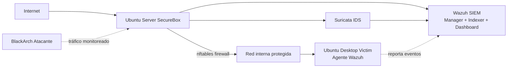

# SecureBox 🛡️

Network Security Appliance modular construido desde cero. Detecta y filtra tráfico malicioso en tiempo real mediante una arquitectura de firewall, IDS y SIEM integrados.

## Arquitectura

## Stack técnico

- **Ubuntu Server 24.04** — sistema base del appliance
- **nftables** — firewall con reglas custom
- **Suricata** — IDS con reglas de detección propias
- **Wazuh** — SIEM (Manager + Indexer + Dashboard)
- **Python** — parser de logs (en progreso)
- **Node.js + Dashboard web** — panel de control propio (en progreso)

## Lo que hace

- Filtra tráfico de red con reglas de firewall personalizadas (nftables)
- Detecta intrusiones en tiempo real con reglas de Suricata propias
- Centraliza y correlaciona eventos de seguridad con Wazuh SIEM
- Monitorea endpoints remotos mediante agentes Wazuh
- Genera alertas ante comportamiento sospechoso o no autorizado

## Progreso

- [x] Firewall con nftables configurado y persistente
- [x] IDS Suricata detectando tráfico en tiempo real
- [x] Primera regla de detección personalizada (ICMP)
- [x] SIEM Wazuh desplegado (Manager + Indexer + Dashboard)
- [x] Agente Wazuh conectado en máquina víctima
- [ ] Primer ataque real correlacionado (Suricata + Wazuh)
- [ ] Parser de logs en Python
- [ ] Dashboard web propio
- [ ] API REST para control remoto
- [ ] Portabilidad (Raspberry Pi)

## Demo

### Fase 1 — Firewall + IDS detectando tráfico

Primeras alertas generadas por Suricata al aplicar reglas de detección de trazas ICMP, con el firewall nftables activo en el servidor.

Aquí se observa cómo una traza ICMP enviada desde la máquina atacante es identificada por el servidor que tiene el firewall y Suricata activos, permitiendo detección temprana de accesos no autorizados según reglas pre-establecidas.

### Fase 2 — Reglas personalizadas de Suricata

Reglas configuradas en `local.rules` para identificar trazas ICMP dirigidas al servidor.

### Fase 3 — Despliegue de Wazuh (SIEM)

Instalación de Wazuh como SIEM para la gestión centralizada de alertas. El dashboard es accesible desde la red interna a través del puerto 8443.

Es importante destacar que el protocolo TCP por el puerto 443 estaba bloqueado por el firewall nftables por defecto, por lo que fue necesario habilitar explícitamente dicho puerto para permitir el acceso al dashboard.

### Fase 4 — Agente en máquina víctima

Se desplegó una nueva máquina virtual (`ubuntu-desktop-victim`) con el agente Wazuh instalado, funcionando como endpoint monitoreado sobre el cual se ejecutarán los ataques desde la máquina atacante.

Vista del summary de endpoints conectados al manager de Wazuh, mostrando el único agente activo hasta el momento.

---

**Próximo paso:** lanzar el primer ataque real desde la máquina atacante (BlackArch) y verificar la correlación entre Suricata y Wazuh en el dashboard, para documentar el primer incident report.
